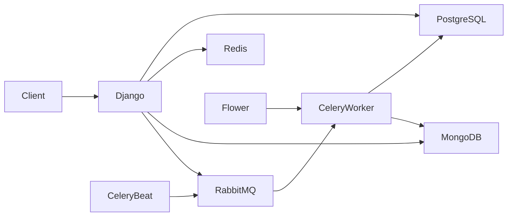

# Django-Docker
Project django-docker app

# Tech Stack
- Python
- Django
- PostgreSQL
- Docker
- Docker Compose

Cara menjalankan project:
```
    docker compose build (untuk pertama kali)
    docker compose up -d (untuk pertama kali)
    docker compose exec web python manage.py migrate 
    docker compose start
```
Cara menutup project:
```  
    docker compose stop
    docker compose down (jika ingin menghentikan dan menghapus compose)
```
Environment variables explanation:
```
    SECRET_KEY → kunci rahasia Django (buat security, jangan bocor)
    DEBUG → mode dev (True = tampilkan error detail)
    ALLOWED_HOSTS → domain/IP yang boleh akses app
 
    DB_NAME → nama database
    DB_USER → user login DB
    DB_PASSWORD → password DB
    DB_HOST → alamat DB (db = nama service Docker)
    DB_PORT → port DB (default PostgreSQL: 5432)
```
Buka di browser:
```
http://localhost:8000 - halaman depan djanggo
http://localhost:8000 - halaman admin
```

halaman depan djanggo

<< Progress 2 >>


halaman depan admin

# Penambahan pada data models:
## 1. User
Custom User menggunakan `AbstractUser`.

Role yang tersedia:
- Admin
- Instructor
- Student


---

## 2. Category

Kategori course dengan struktur hierarki menggunakan Self ForeignKey.

Contoh:

```
Programming
├── Web Development
└── Mobile Development
```


---

## 3. Course

Setiap course memiliki:

- Instructor
- Category

Relasi:

```
Instructor (User)
        │
        ▼
      Course
        ▲
        │
    Category
```


---

## 4. Lesson

Setiap Course memiliki banyak Lesson.

Fitur:

- Ordering lesson
- Inline editing pada Django Admin


---

## 5. Enrollment

Relasi antara Student dan Course.

Constraint:

- Satu student tidak dapat mendaftar course yang sama lebih dari satu kali.

Menggunakan:

```python
unique_together = ('student', 'course')
```


---

## 6. Progress

Mencatat progress penyelesaian lesson.

Status:

- Completed
- In Progress


# Custom Model Managers

## Course Manager

### `Course.objects.for_listing()`

Digunakan untuk mengoptimalkan query pada halaman daftar course menggunakan `select_related()`.

Contoh:

```python
Course.objects.for_listing()
```

---

## Enrollment Manager

### `Enrollment.objects.for_student_dashboard()`

Mengoptimalkan dashboard student dengan memanfaatkan:

- `select_related()`
- `prefetch_related()`

untuk mengurangi jumlah query database.

Contoh:

```python
Enrollment.objects.for_student_dashboard()
```

---
# Query Optimization

Project ini mendemonstrasikan masalah **N+1 Query Problem**.

## Tanpa Optimasi

```
Enrollment
 ├── Query Enrollment
 ├── Query Course
 ├── Query Instructor
 ├── Query Category
 ├── Query Lesson
 └── ...
```

Jumlah query meningkat seiring bertambahnya data.

---

## Dengan Optimasi

Menggunakan:

```python
select_related()
prefetch_related()
```

Sehingga data terkait diambil dalam jumlah query yang jauh lebih sedikit.

# Django Admin

Konfigurasi Admin meliputi:

- Informative List Display
- Search Functionality
- Filter Data
- Lesson Inline pada Course
- Optimized Query menggunakan `list_select_related()`

---

# << Progress 3 >>

Pada progress ini sistem dikembangkan menjadi **REST API** menggunakan **Django Ninja** dengan implementasi **JWT Authentication**, **Role-Based Access Control (RBAC)**, dan dokumentasi API menggunakan **Swagger**.

# Tech Stack (Tambahan)

- Django Ninja
- Pydantic
- JWT (JSON Web Token)
- Swagger UI

---

# REST API Documentation

Dokumentasi API dapat diakses melalui:

```
http://localhost:8000/api/docs
```

OpenAPI JSON:

```
http://localhost:8000/api/openapi.json
```

> Tambahkan screenshot halaman Swagger UI di bawah ini.

<!-- Screenshot Swagger -->

---

# Authentication System

Autentikasi menggunakan **JWT (JSON Web Token)**.

Flow autentikasi:

```
Register
     │
     ▼
 Login
     │
     ▼
Access Token + Refresh Token
     │
     ▼
Authorization: Bearer <access_token>
     │
     ▼
Protected Endpoint
```

Fitur yang telah diimplementasikan:

- User Registration
- User Login
- JWT Access Token
- JWT Refresh Token
- Current User Endpoint
- Update Profile
- Password Hashing menggunakan Django Authentication

---

# Authentication Endpoints

## Register

```
POST /api/auth/register
```

Mendaftarkan user baru.

Request:

```json
{
    "username": "student1",
    "email": "student@email.com",
    "password": "password123"
}
```

Response:

```json
{
    "id": 1,
    "username": "student1",
    "email": "student@email.com",
    "role": "student"
}
```

---

## Login

```
POST /api/auth/login
```

Login dan menghasilkan JWT Token.

Response:

```json
{
    "access": "<access_token>",
    "refresh": "<refresh_token>"
}
```

---

## Refresh Token

```
POST /api/auth/refresh
```

Menghasilkan Access Token baru menggunakan Refresh Token.

---

## Current User

```
GET /api/auth/me
```

Mengambil informasi user yang sedang login.

---

## Update Profile

```
PUT /api/auth/me
```

Mengubah informasi profile user.

---

# Public API

Endpoint yang dapat diakses tanpa login.

## List Courses

```
GET /api/courses
```

Menampilkan daftar seluruh course.

Fitur:

- List Course
- Nested Instructor
- Nested Category

---

## Course Detail

```
GET /api/courses/{id}
```

Menampilkan detail course berdasarkan ID.

---

# Protected API

Endpoint yang membutuhkan JWT Authentication.

## Create Course

```
POST /api/courses
```

Hak akses:

- Instructor

Instructor dapat membuat course baru.

---

## Update Course

```
PATCH /api/courses/{id}
```

Hak akses:

- Instructor (Owner)

Instructor hanya dapat mengubah course miliknya sendiri.

---

## Delete Course

```
DELETE /api/courses/{id}
```

Hak akses:

- Admin

Hanya Admin yang dapat menghapus course.

---

# Enrollment API

## Enroll Course

```
POST /api/enrollments
```

Hak akses:

- Student

Student dapat mendaftar ke course.

Constraint:

- Tidak dapat mendaftar course yang sama lebih dari satu kali.

---

## My Courses

```
GET /api/enrollments/my-courses
```

Hak akses:

- Student

Menampilkan seluruh course yang telah diikuti oleh student.

---

## Lesson Progress

```
POST /api/enrollments/{id}/progress
```

Hak akses:

- Student

Menandai lesson sebagai selesai.

Validasi:

- Lesson harus berasal dari course yang sedang diikuti.

---

# Role Based Access Control (RBAC)

Project menerapkan Role-Based Access Control menggunakan Custom Permission.

Role yang tersedia:

- Admin
- Instructor
- Student

Permission:

| Role | Permission |
|------|------------|
| Admin | Delete Course |
| Instructor | Create Course |
| Instructor (Owner) | Update Course |
| Student | Enrollment Course |
| Student | Update Lesson Progress |

Permission diimplementasikan melalui helper:

```python
is_admin()
is_instructor()
is_student()
is_course_owner()
```

---

# JWT Authentication Middleware

Seluruh endpoint protected menggunakan custom authentication class.

```
Authorization
        │
        ▼
Bearer Token
        │
        ▼
JWT Validation
        │
        ▼
Authenticated User
```

Authentication dilakukan menggunakan class:

```python
JWTAuth(HttpBearer)
```

---

# Pydantic Schema Validation

Seluruh request dan response API divalidasi menggunakan Pydantic Schema.

Schema yang digunakan antara lain:

- RegisterSchema
- LoginSchema
- RefreshSchema
- UserOut
- CourseOut
- CourseCreate
- EnrollmentCreate
- EnrollmentOut
- ProgressCreate
- ProgressOut

Keuntungan:

- Automatic Validation
- Automatic Serialization
- Automatic Swagger Documentation

---

# Project Structure

```
apps/
│
├── api/
│   ├── auth.py
│   ├── courses.py
│   ├── enrollments.py
│   ├── permissions.py
│   ├── router.py
│   ├── schemas.py
│   └── security.py
│
├── migrations/
├── admin.py
├── models.py
└── ...
```

---

# API Summary

| Endpoint | Authentication | Role |
|-----------|---------------|------|
| POST /api/auth/register | Public | - |
| POST /api/auth/login | Public | - |
| POST /api/auth/refresh | Public | - |
| GET /api/auth/me | JWT | All User |
| PUT /api/auth/me | JWT | All User |
| GET /api/courses | Public | - |
| GET /api/courses/{id} | Public | - |
| POST /api/courses | JWT | Instructor |
| PATCH /api/courses/{id} | JWT | Instructor (Owner) |
| DELETE /api/courses/{id} | JWT | Admin |
| POST /api/enrollments | JWT | Student |
| GET /api/enrollments/my-courses | JWT | Student |
| POST /api/enrollments/{id}/progress | JWT | Student |

---

# << Progress 4 >>

Pada progress ini sistem dikembangkan dengan menambahkan **Redis** sebagai caching layer, **MongoDB** untuk penyimpanan activity log dan learning analytics, serta **Celery** dengan **RabbitMQ** untuk menjalankan asynchronous task. Selain itu ditambahkan **Flower** sebagai monitoring Celery Worker.

# Tech Stack (Tambahan)

- Redis
- Celery
- RabbitMQ
- Flower

---

# Architecture

Project menggunakan beberapa service yang saling terintegrasi.



---

# Docker Services

Project sekarang menggunakan beberapa container:

| Service | Fungsi |
|----------|---------|
| Django | REST API |
| PostgreSQL | Relational Database |
| Redis | Caching & Rate Limiting |
| MongoDB | Activity Log & Analytics |
| RabbitMQ | Message Broker |
| Celery Worker | Menjalankan asynchronous task |
| Celery Beat | Menjalankan scheduled task |
| Flower | Monitoring Celery |

---

# Redis Integration

Redis digunakan sebagai cache untuk mengurangi query langsung ke PostgreSQL.

Implementasi:

- Course List Cache
- Course Detail Cache
- Cache Invalidation
- Rate Limiting

---

## Course List Cache

Endpoint:

```
GET /api/courses
```

Flow:

```
Request
   │
   ▼
Redis
   │
 ┌─┴──────────┐
 │            │
Hit         Miss
 │            │
 ▼            ▼
Return     PostgreSQL
Cache      Query
              │
              ▼
        Save to Redis
```

Cache Key:

```
course_list
```

---

## Course Detail Cache

Endpoint:

```
GET /api/courses/{id}
```

Cache Key:

```
course_<course_id>
```

Contoh:

```
course_1
course_2
course_3
```

---

## Cache Invalidation

Cache akan dihapus ketika data Course berubah.

Terjadi pada endpoint:

- Create Course
- Update Course
- Delete Course

Cache yang dihapus:

```
course_list

course_<id>
```

Dengan strategi ini data cache selalu konsisten dengan database.

---

# Rate Limiting

Rate limiting diimplementasikan menggunakan Redis.

Limit:

```
60 request / menit
```

Apabila melebihi limit maka API akan mengembalikan response:

```
429 Too Many Requests
```

---

# MongoDB Integration

MongoDB digunakan sebagai document database untuk menyimpan data yang tidak memerlukan relasi kompleks.

Collection yang digunakan:

- activity_logs
- learning_analytics

---

## Activity Logs

Menyimpan seluruh aktivitas penting user.

Contoh data:

```json
{
    "user": "student1",
    "action": "ENROLL_COURSE",
    "detail": {
        "course": "Python Backend"
    },
    "timestamp": "2026-07-05T18:00:00"
}
```

Activity yang dicatat antara lain:

- Login
- Create Course
- Update Course
- Delete Course
- Enrollment
- Complete Lesson

---

## Learning Analytics

Digunakan untuk menyimpan data analitik pembelajaran.

Contoh:

```json
{
    "course": "Python Backend",
    "student": "student1",
    "completed": true,
    "timestamp": "2026-07-05T18:30:00"
}
```

Collection ini dapat digunakan untuk membuat dashboard atau laporan analitik.

---

# Aggregation Report

MongoDB Aggregation digunakan untuk menghasilkan laporan.

Contoh:

- Total completion setiap course
- Total aktivitas user
- Statistik pembelajaran

---

# Celery Integration

Celery digunakan untuk menjalankan proses asynchronous sehingga request API dapat diproses lebih cepat.

Flow:

```
API Request
      │
      ▼
RabbitMQ
      │
      ▼
Celery Worker
      │
      ▼
Execute Task
```

---

# Celery Tasks

Task yang telah dibuat:

## 1. Send Enrollment Email

Task:

```
send_enrollment_email
```

Dijalankan ketika student berhasil melakukan enrollment.

---

## 2. Generate Certificate

Task:

```
generate_certificate
```

Dijalankan ketika seluruh lesson pada course telah selesai.

---

## 3. Update Course Statistics

Task:

```
update_course_statistics
```

Berjalan secara terjadwal menggunakan Celery Beat.

Fungsi:

- Menghitung jumlah enrollment setiap course
- Memperbarui statistik course

---

## 4. Export Course Report

Task:

```
export_course_report
```

Menghasilkan file CSV secara asynchronous.

Contoh isi:

```
ID,Title,Instructor,Category
1,Python Backend,admin,Programming
2,Android Development,instructor,Mobile Development
```

---

# RabbitMQ

RabbitMQ digunakan sebagai message broker.

Fungsi:

- Menyimpan antrean task
- Menghubungkan Django dengan Celery Worker
- Menjamin task diproses secara asynchronous

Management Dashboard:

```
http://localhost:15672
```

Default Login:

```
Username : guest

Password : guest
```

---

# Celery Beat

Celery Beat digunakan untuk menjalankan task berdasarkan jadwal.

Contoh scheduled task:

- Update Course Statistics setiap 1 menit (development)
- Export Course Report setiap hari

Flow:

```
Celery Beat
      │
      ▼
RabbitMQ
      │
      ▼
Celery Worker
```

---

# Flower

Flower digunakan untuk monitoring Celery.

Dashboard:

```
http://localhost:5555
```

Informasi yang dapat dilihat:

- Active Worker
- Running Task
- Completed Task
- Failed Task
- Task History

---

# Redis CLI

Masuk ke Redis CLI:

```bash
docker compose exec redis redis-cli
```

Beberapa command yang sering digunakan:

Lihat seluruh key

```bash
KEYS *
```

Melihat isi cache

```bash
GET course_list
```

Menghapus cache

```bash
DEL course_list
```

Menghapus seluruh cache

```bash
FLUSHALL
```

---

# Project Structure

```
apps/
│
├── api/
├── mongodb/
│   ├── client.py
│   ├── logger.py
│   └── report.py
│
├── tasks/
│   ├── email_tasks.py
│   ├── certificate_tasks.py
│   ├── statistics_tasks.py
│   └── report_tasks.py
│
├── models.py
└── ...
```

---

# Monitoring Dashboard

| Service | URL |
|----------|-----|
| Swagger | http://localhost:8000/api/docs |
| Flower | http://localhost:5555 |
| RabbitMQ | http://localhost:15672 |

---

# Progress 4 Summary

Fitur yang berhasil diimplementasikan:

- ✅ Redis Caching
- ✅ Course List Cache
- ✅ Course Detail Cache
- ✅ Cache Invalidation
- ✅ Redis Rate Limiting
- ✅ MongoDB Activity Logs
- ✅ MongoDB Learning Analytics
- ✅ MongoDB Aggregation
- ✅ Celery Worker
- ✅ RabbitMQ
- ✅ Celery Beat
- ✅ Flower Monitoring
- ✅ Send Enrollment Email Task
- ✅ Generate Certificate Task
- ✅ Update Course Statistics Task
- ✅ Export Course Report Task
---

# << Progress 5 (UAS) >>

Pada progress ini dilakukan penyempurnaan fitur Learning Management System (LMS) yang telah dibangun pada progress sebelumnya. Fokus utama pengembangan meliputi sistem review course, wishlist, dashboard mahasiswa, rekomendasi course, optimasi performa, serta penyempurnaan logging dan asynchronous processing.

# Fitur Baru

## 1. Dashboard Student

Ditambahkan endpoint dashboard yang menampilkan ringkasan aktivitas mahasiswa.

Endpoint:

```
GET /api/dashboard
```

Informasi yang ditampilkan:

- Active Courses
- Completed Courses
- Wishlist Count
- Recommendation Count
- Overall Progress
- Active Course List
- Recommended Courses

Contoh response:

```json
{
    "active_courses": 2,
    "completed_courses": 1,
    "wishlist_count": 3,
    "recommendation_count": 2,
    "overall_progress": 75
}
```

---

## 2. Wishlist

Mahasiswa dapat menyimpan course yang ingin dipelajari.

Endpoint:

```
POST /api/wishlist/{course_id}
```

Menghapus wishlist:

```
DELETE /api/wishlist/{course_id}
```

Melihat wishlist:

```
GET /api/wishlist
```

Constraint:

- Course tidak dapat ditambahkan dua kali ke wishlist.

---

## 3. Review & Rating

Mahasiswa dapat memberikan penilaian terhadap course yang telah diikuti.

Endpoint:

```
POST /api/reviews/{course_id}
```

Update review:

```
PATCH /api/reviews/{review_id}
```

Delete review:

```
DELETE /api/reviews/{review_id}
```

List review:

```
GET /api/reviews/course/{course_id}
```

Validasi:

- Hanya student yang telah melakukan enrollment yang dapat memberikan review.
- Satu student hanya dapat memberikan satu review pada setiap course.
- Rating memiliki rentang nilai 1–10.

---

## 4. Automatic Course Rating

Nilai rata-rata rating course dihitung secara otomatis.

Setiap kali:

- membuat review
- mengubah review
- menghapus review

maka field:

```
average_rating
```

akan diperbarui menggunakan Django Aggregation.

Contoh:

```python
Review.objects.aggregate(
    Avg("rating")
)
```

---

## 5. Student Progress

Progress pembelajaran dihitung berdasarkan jumlah lesson yang telah diselesaikan.

Rumus:

```
Progress =
Completed Lesson
---------------- × 100%
Total Lesson
```

Progress ditampilkan pada Dashboard Student.

---

## 6. Course Recommendation

Dashboard akan memberikan rekomendasi course berdasarkan kategori course yang sedang dipelajari mahasiswa.

Urutan rekomendasi:

- Average Rating tertinggi
- Student Count terbanyak

Course yang sudah diikuti tidak akan direkomendasikan kembali.

---

## 7. Dashboard Cache

Dashboard menggunakan Redis Cache.

Cache Key:

```
dashboard_<user_id>
```

Contoh:

```
dashboard_4
```

Cache akan dihapus ketika:

- enrollment baru
- progress selesai
- review berubah
- wishlist berubah

Sehingga data dashboard tetap konsisten.

---

## 8. Cache Invalidation

Redis cache diperluas sehingga perubahan data penting langsung memperbarui cache.

Cache akan dibersihkan ketika:

- Create Course
- Update Course
- Delete Course
- Enrollment
- Complete Course
- Review
- Wishlist

---

## 9. Activity Logging

MongoDB Activity Log diperluas.

Activity yang dicatat:

- View Dashboard
- Add Wishlist
- Remove Wishlist
- Create Review
- Update Review
- Delete Review
- Complete Course

Contoh dokumen:

```json
{
    "user": "student1",
    "action": "CREATE_REVIEW",
    "detail": {
        "course_id": 1,
        "rating": 9
    }
}
```

---

## 10. Learning Analytics

Learning Analytics diperbarui setiap kali student menyelesaikan lesson.

Informasi yang dicatat:

- Student
- Course
- Completion Status
- Timestamp

Data ini dapat digunakan sebagai dasar analisis perkembangan pembelajaran.

---

## 11. Celery Integration

Implementasi Celery diperluas untuk menjalankan proses asynchronous.

Task yang digunakan:

- Send Enrollment Email
- Generate Certificate
- Update Course Statistics
- Export Course Report

Semua task dikirim melalui RabbitMQ dan diproses oleh Celery Worker.

---

## 12. RabbitMQ Monitoring

RabbitMQ digunakan sebagai message broker.

Dashboard:

```
http://localhost:15672
```

Informasi yang tersedia:

- Queued Messages
- Message Rate
- Exchanges
- Queues
- Consumers
- Connections

---

## 13. Flower Monitoring

Flower digunakan untuk memonitor Celery Worker.

Dashboard:

```
http://localhost:5555
```

Informasi yang dapat dipantau:

- Worker Status
- Active Task
- Processed Task
- Success Task
- Failed Task
- Load Average

---

# API Summary (Tambahan)

| Endpoint | Method | Role |
|-----------|--------|------|
| /api/dashboard | GET | Student |
| /api/wishlist | GET | Student |
| /api/wishlist/{id} | POST | Student |
| /api/wishlist/{id} | DELETE | Student |
| /api/reviews/{course_id} | POST | Student |
| /api/reviews/{review_id} | PATCH | Student |
| /api/reviews/{review_id} | DELETE | Student |
| /api/reviews/course/{course_id} | GET | Public |

---

# Progress 5 Summary

Fitur yang berhasil diimplementasikan:

- ✅ Student Dashboard
- ✅ Overall Progress
- ✅ Dashboard Cache
- ✅ Wishlist
- ✅ Review System
- ✅ Course Rating
- ✅ Recommendation Course
- ✅ Automatic Average Rating
- ✅ Complete Course Detection
- ✅ MongoDB Activity Log
- ✅ Learning Analytics
- ✅ Redis Cache Invalidation
- ✅ RabbitMQ Monitoring
- ✅ Flower Monitoring
- ✅ Celery Background Tasks
